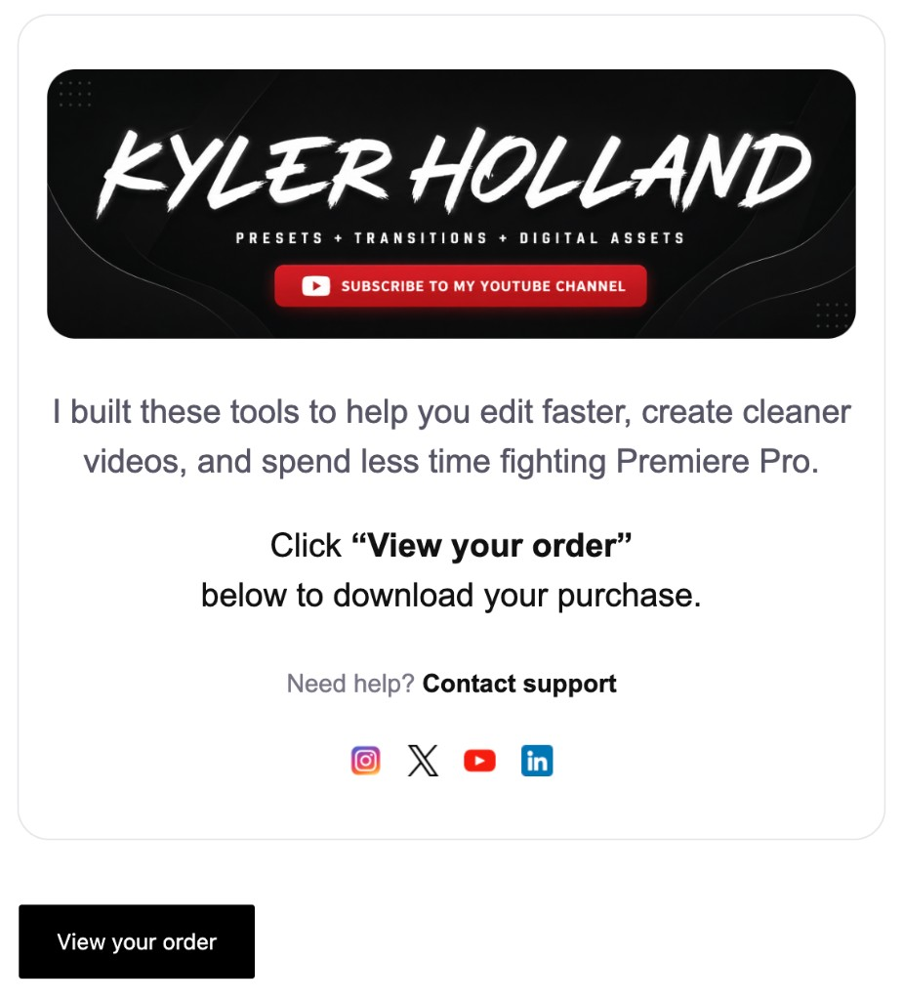
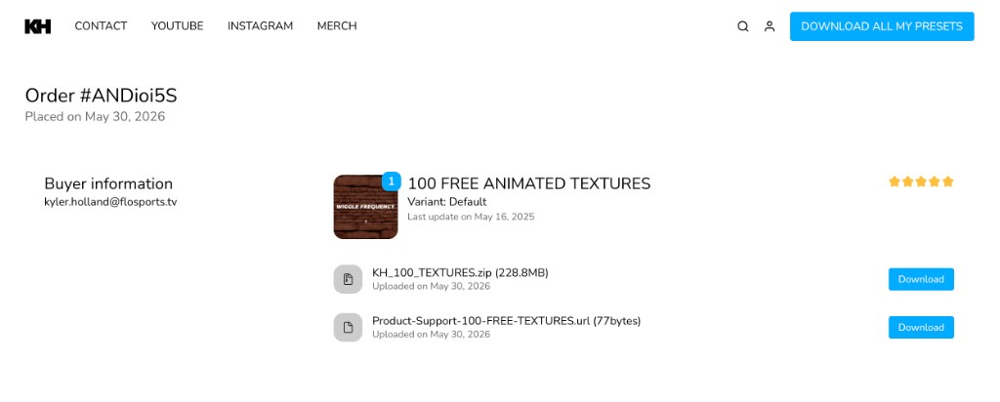
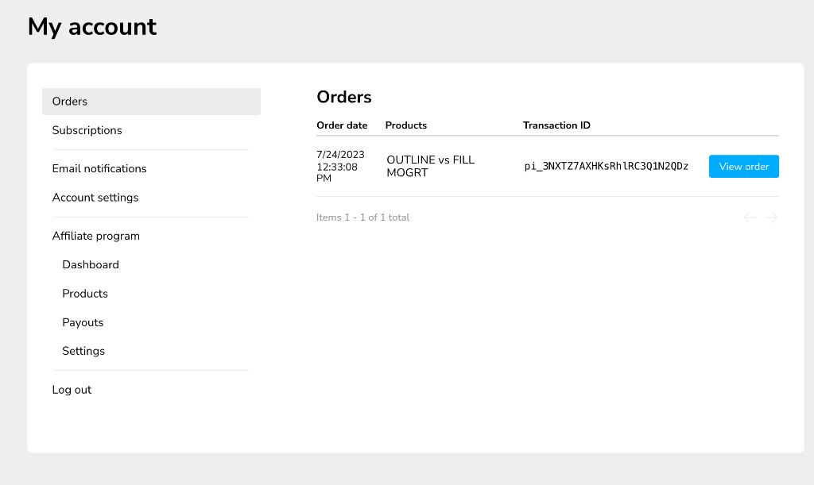

# Getting Started

You just picked up a Kyler Holland product — presets, transitions, LUTs, motion graphics, sound effects, or more. This page walks you from checkout to your timeline in a few minutes.

!!!tip Start here after purchase
Work through the steps below in order: **download → extract → install**. If something breaks, jump to [Troubleshooting](../support/troubleshooting.md) or your product's help page in the sidebar.
!!!

## Quick start

1. **Download** the `.zip` from your confirmation email, or [sign in to your account](https://assets.kylerholland.com/u/signin/) and open **Orders**.
2. **Extract** the archive on your computer. Do not drag the `.zip` into Premiere — use the files inside.
3. **Install** using the method that matches your file type (`.prfpset`, `.prproj`, MOGRT, `.cube`, etc.).
4. **Open your product** in the sidebar for pack-specific steps, tutorials, and tips.

[!card layout="signal" icon="package" title="How products install" text="Step-by-step workflows for every KH file type — presets, projects, MOGRT, LUTs, and more." kicker="Open"](how-products-install.md)
[!card layout="signal" icon="download" title="Downloads & updates" text="Re-download a purchase, grab the latest version, or move packs to a new computer." kicker="Open"](../support/downloads-and-updates.md)
[!card layout="signal" icon="alert" title="Troubleshooting" text="Fixes for missing presets, import errors, macOS warnings, and account issues." kicker="Open"](../support/troubleshooting.md)

---

## How to download your products

### Right after you purchase

When checkout is complete, look for a confirmation email:

- **From:** KYLER HOLLAND (`store+kylerholland@mail.sellfy.store`)
- **Subject:** Thanks for your purchase! Download your assets now

1. Open the email and click **View your order**.
2. On your order page, click **Download** next to the product `.zip` file.
3. **Extract** the `.zip` on your computer, then follow the install steps for your product.

Each order usually includes two downloads:

| File | What it is |
|------|------------|
| Product `.zip` | The pack you purchased |
| `Product-Support-*.url` | A shortcut to this help center for that product |

!!!tip Check spam
Search for **Thanks for your purchase! Download your assets now** from `store+kylerholland@mail.sellfy.store`. If you don't see it within a few minutes, check your spam or promotions folder.
!!!

### Download again later

Lost the email, got a new computer, or need a fresh copy? Your purchases stay in your account:

1. Go to **[Sign in](https://assets.kylerholland.com/u/signin/)**.
2. Enter the **email address you used at checkout**.
3. Open **Orders** in the sidebar.
4. Find your purchase and click **View order**.
5. Click **Download** on your order page.

**Free products** also go through checkout and appear under **Orders** — re-download them the same way as paid products.

For updated pack files and version notes, see **[Downloads & updates](../support/downloads-and-updates.md)**.

!!!tip Can't sign in?
Use the same email from your purchase receipt. If you still can't access your order, [contact support](../support/contact.md).
!!!

---

## Install your products

KH packs use different file types depending on what you bought. Match your download to the right workflow:

| If your download includes… | Install method |
|----------------------------|----------------|
| `.prfpset` | **Effects → Presets** → Import Presets |
| `.prproj` | Drag the project into the **Project** panel |
| `.mogrt` | **Essential Graphics** panel → Install Motion Graphics Template |
| `.cube` | **Lumetri Color** or import the included `.prfpset` |
| Video / audio files | **File → Import** into a bin |
| `.xmp` / `.dng` | Lightroom import (see product help page) |

Open **[How KH products install](how-products-install.md)** for full steps, example products, and version-folder tips.

Then find **your product** in the sidebar for install notes, tutorials, and troubleshooting specific to that pack.

---

## Find help fast

- **Search** — Use the search box at the top of any page.
- **Browse products** — Pick your pack from the sidebar or [all products](../products/index.md).
- **Watch a tutorial** — [Tutorial index](../support/tutorial-index.md)
- **Common fixes** — [Troubleshooting & FAQ](../support/troubleshooting.md)
- **Still stuck?** — [Contact support](../support/contact.md)

---

Can't find your product or need a hand? [Reach out to support](../support/contact.md) with your order email and product name.
