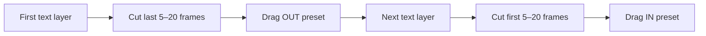

# 200+ Text Effects

Level up your text animations with a massive Premiere Pro text preset pack — **200+ drag-and-drop** transitions and effects.

!!!success What's inside
**200+ presets** organized by **IN**, **OUT**, and **EFFECTS** — blur, glitch, displace, slide, scale, strobe, RGB, 3D, VR, and more. Works natively in the **Effects** tab. Layer presets for unlimited combinations.
!!!


[!button variant="primary" icon="arrow-down" iconAlign="left" text="Download The Pack"](https://www.kylerholland.com/checkout/200texteffects)

After checkout, open the email **Thanks for your purchase! Download your assets now** from KYLER HOLLAND → **View your order** → **Download** the `.zip`.

Lost your download link? [Download again later](../../getting-started/index.md#download-again-later)
---

## Video walkthrough

Watch the full tutorial

https://www.youtube.com/embed/S7ntryI65rA

---

## Quick reference

| Preset type | Apply to | Use for |
|-------------|----------|---------|
| **IN** | **Start** of text clip (5–20 frame trim) | Entrance |
| **OUT** | **End** of text clip (5–20 frame trim) | Exit → hands off to next line's **IN** |
| **EFFECTS** | Full clip (any duration) | Blur, strobe, RGB, smoke, static, etc. |

| Symbol | Strength |
|--------|----------|
| **+** | Light |
| **++** | Medium |
| **+++** | Heavy |
| **++++** | Extra heavy |



!!!tip Pro tip
Combine **EFFECTS** on the full line with **IN** / **OUT** on short trimmed segments. Use **Remove Attributes** before swapping presets so effects don't stack by accident.
!!!

---

## Installation

+++ Windows
1. Download the `.zip` from your [order email](https://assets.kylerholland.com/u/signin/) or checkout confirmation.
2. Right-click the `.zip` → **Extract All** → choose a folder you'll remember (e.g. `Downloads/KH Presets/200 Text Effects`).
3. Open **Adobe Premiere Pro** and your project.
4. **Effects** panel → right-click **Presets** → **Import Presets**.
5. Select the `.prfpset` from the extracted folder → **Open**.
6. Expand the bin — confirm **IN**, **OUT**, and **EFFECTS** folders appear.
+++ Mac
1. Download the `.zip` from your [order email](https://assets.kylerholland.com/u/signin/) or checkout confirmation.
2. Double-click the `.zip` to extract (or right-click → **Open**). Keep files in Downloads or move to `Downloads/KH Presets/200 Text Effects`.
3. Open **Adobe Premiere Pro** and your project.
4. **Effects** panel → right-click **Presets** → **Import Presets**.
5. Select the `.prfpset` from the extracted folder → **Open**.
6. Expand the bin — confirm **IN**, **OUT**, and **EFFECTS** folders appear.
+++

### Folder structure

```text
Downloads/
└── 200+ Text Effects/          (extracted)
    └──  *.prfpset               ← import this file
```

!!!warning Import the preset file, not the ZIP
Right-click **Presets** → **Import Presets** and choose the `.prfpset`. Importing the `.zip` directly will not work.
!!!

---

## How to use

### IN + OUT transitions (between lines)

1. Add a **text layer** to the timeline.
2. **Cut** **5–20 frames** at the **end** (for **OUT**) or **beginning** (for **IN**) of the clip.
3. Drag an **OUT** preset onto the **end** of the first text layer.
4. Drag an **IN** preset onto the **beginning** of the next text layer.
5. Shorten or lengthen the cut if the move feels too fast or slow.

!!!info Where presets go
**OUT** = end of the outgoing text clip. **IN** = start of the incoming text clip. That's what creates a seamless transition between lines.
!!!

### EFFECTS (style for the whole line)

1. Select the text clip.
2. Drag any **EFFECTS** preset onto it (blur, strobe, RGB, smoke, etc.).
3. Optionally add **IN** + **OUT** on head/tail segments for enter → stylize → exit.

---

## Preset catalog

Browse **IN**, **OUT**, and **EFFECTS** in the Effects panel — names match the lists below. **OUT** uses the same preset names as **IN**; only placement (end vs. start) changes.

==- EFFECTS presets
Apply anywhere on the text clip:

- Blur Horizontal ++ · Blur Vertical ++
- Displace Horizontal +, ++ · Displace Vertical +, ++
- Dissolve +, ++ · Emboss + · Grid + · Magnify + · Mirror +
- Offset Horizontal + · Offset Vertical +
- RGB Constant +, ++, +++, ++++
- Strobe +, ++, +++ · TV Static +, ++
- Glow +, ++ · Smoke +, ++, +++, ++++ · Strings +, ++
===

==- IN presets
- Blur Horizontal +, ++, +++
- Blur Vertical +, ++, +++
- Lens Distortion +, ++, +++
- Grid Glitch + · Grid Horizontal + · Grid Horizontal and Vertical + · Grid Vertical +
- Twirl Left +, ++ · Twirl Right +, ++
- 3D Flip Back + · 3D Flip Forward + · 3D Swivel Left + · 3D Swivel Right + · Flip +, ++
- Displace Cross +, ++ · Displace Cross Glitch +, ++
- Displace Horizontal +, ++ · Displace Horizontal Glitch +, ++
- Displace Vertical +, ++ · Displace Vertical Glitch +, ++
- VR Pan Left +, ++, +++ · VR Pan Right +, ++, +++
- VR Spin Left + · VR Spin Right +
- Scale Down +, ++, +++ · Scale Up +, ++, +++
- Scale Height Down +, ++ · Scale Height Up +, ++
- Scale Width Down +, ++, +++ · Scale Width Up +, ++, +++
- Slide Up / Down / Left / Right +, ++, +++
- Slide Lower Left / Lower Right / Upper Left / Upper Right +, ++, +++
===

==- OUT presets
**Same names as IN** — apply to the **last 5–20 frames** (or trimmed tail) of each text layer, then **IN** on the next line's head.
===

---

## Free vs paid

| | Free (video code) | Paid ($5) |
|---|:---:|:---:|
| All 200+ presets | ✅ | ✅ |
| Support channel | Optional | ✅ |
| Instant download | After code in video | ✅ |

The product page may offer a **100% off** code in the [YouTube tutorial](https://www.youtube.com/watch?v=S7ntryI65rA) — watch for on-screen letters during the video if you want the free checkout path.

---

## Troubleshooting

==- Why isn't my preset bin showing?
- Right Click on the **`.prfpset`** file to Import, not the `.zip`
- **Effects** panel → expand **Presets** → look for the pack folder
- Restart Premiere if the bin doesn't appear after import
===

==- The transition feels too fast or slow
- Adjust the **cut** (try 5, 10, or 20 frames)
- Some presets read differently on 24fps vs 30fps timelines — preview with loop enabled
===

==- Effects stacked and look broken
- Right-click clip → **Remove Attributes** → **OK**
- Re-apply one **IN** or **OUT** at a time, then add **EFFECTS** last
===

==- Can I use this on MOGRT / Essential Graphics titles?
Built for **timeline text layers** you cut and trim. MOGRTs sometimes work, but the documented workflow is native text + Effects panel presets.
===

==- I lost my download link
Search for **Thanks for your purchase! Download your assets now** from `store+kylerholland@mail.sellfy.store` → **View your order**. Or [sign in](https://assets.kylerholland.com/u/signin/) → **Orders**. Details: [Downloads & updates](../../support/downloads-and-updates.md).
===

---

## Need more help?

[!button text="Watch tutorial" variant="info" target="blank"](https://www.youtube.com/watch?v=S7ntryI65rA) [!button text="Contact support" variant="secondary"](../../support/contact.md) [!button text="Report a bug" variant="secondary"](../../support/report-a-bug.md)
