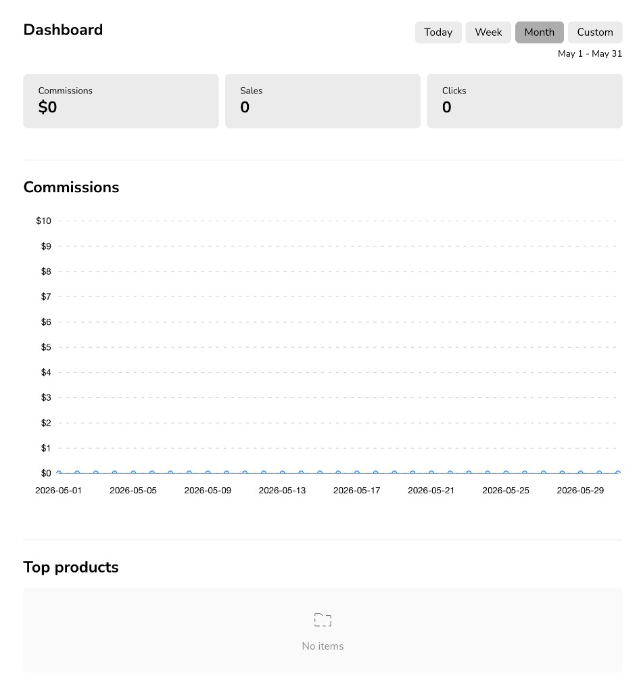
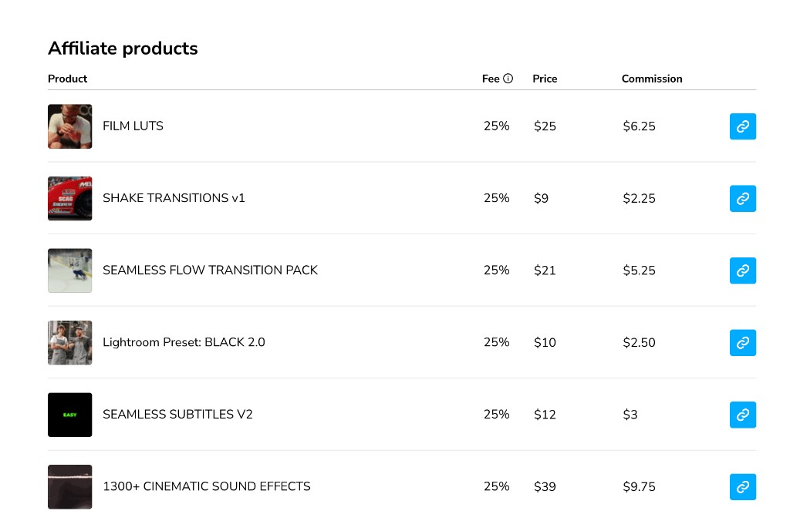
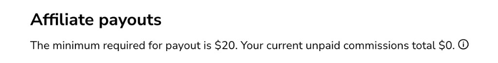

# Affiliate Program

Earn commission when someone buys a Kyler Holland product through your affiliate link.

## Program details

| Setting | Value |
|---------|-------|
| Commission rate | **25%** on all products |
| Payout minimum | **$20.00 USD** |
| Link tracking | **7 days** after someone clicks your link |

If a customer purchases within 7 days of clicking your link, you earn 25% of that sale. Commissions are paid once your unpaid balance reaches $20.

## Join the program

1. Go to **[Sign up for the affiliate program](https://bit.ly/KHaffiliate)**.
2. Sign in with the **email address** you want to use for your affiliate account.

After you sign in, you land on your affiliate dashboard.

## Your dashboard

The dashboard shows how your links are performing. Use the time filters (**Today**, **Week**, **Month**, or **Custom**) to change the date range.

- **Commissions** — Total earnings for the selected period
- **Sales** — Number of referred purchases
- **Clicks** — How many times your links were clicked

## Create affiliate links

Open **Products** in the sidebar to see every product you can promote. Each row shows the product price, your **25%** fee, and the commission you earn per sale.

Click the **link** button on a product row to copy your unique tracking link for that product.

Share that link anywhere you promote Kyler Holland products (YouTube descriptions, social posts, your website, and so on).

## Payouts

Open **Payouts** to see your unpaid commission balance and the payout threshold.

Payouts are sent once your unpaid commissions total at least **$20.00 USD**.

## Settings

In **Settings**, keep your account details up to date:

- **Affiliate code** — Your unique partner identifier
- **PayPal email** — Where payouts are sent
- **Billing information** — Required for tax and payout processing

Make sure your PayPal email is correct before you expect a payout.

## Questions?

[Contact support](contact.md) and mention the affiliate program. Include the email you use to sign in to your affiliate account.
